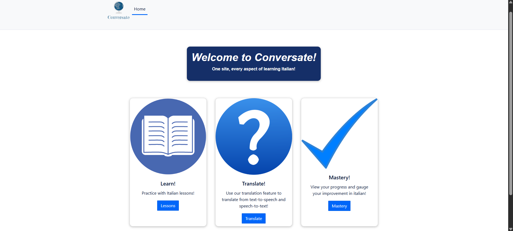

# CapstoneProject

A full-stack demo project showcasing a language learning web app with authentication, flashcards, and translation features. This project is designed as a professional portfolio piece to highlight skills in Flask (Python), Vue.js, and PostgreSQL.

# Features

🔑 Authentication with Auth0 (secure login/logout, profile handling).

🗄 Backend API built with Flask + SQLAlchemy, migrations managed by Flask-Migrate (powered by Alembic).

🌐 Frontend built in Vue.js with Vue Router and Auth0 integration.

📝 CRUD operations for lessons, flashcards, and user profiles.

📊 Database migrations using Alembic to evolve schema over time.

🎯 Demo ready: local environment spins up with python manage.py runserver (backend) and npm run serve (frontend).

# Tech Stack
Backend

Python 3.9

Flask 1.1

Flask-Migrate + Alembic

Flask-SQLAlchemy

PostgreSQL

Gunicorn (production ready WSGI server)

Frontend

Vue.js 2

Vue Router

Auth0 SPA SDK

Sass for styling

Installation
Backend
# Clone repository
git clone https://github.com/ryanhillman/CapstoneProject.git
cd CapstoneProject/backend

# Create and activate virtual environment
python3.9 -m venv venv
venv\Scripts\activate   # Windows
source venv/bin/activate  # Mac/Linux

# Install dependencies
pip install -r requirements.txt

# Run database migrations
python manage.py db upgrade

# Start backend
python manage.py runserver

The backend will run on http://127.0.0.1:5000
.

Frontend
cd CapstoneProject/front-end

# Install dependencies
npm install

# Run development server
npm run serve

The frontend will run on:

Local: http://localhost:3000
 ✅ (works with Auth0)

Network: http://<your-ip>:3000 ⚠️ (may show Auth0 error: requires HTTPS/secure origin)

# Known Limitations

Auth0 requires secure origins.

✅ Works with http://localhost:3000

❌ Fails on http://<LAN-IP>:3000 unless HTTPS is configured

Some deprecated dependencies may show warnings (e.g., sass-loader, legacy-js-api).

# Screenshot of home page

